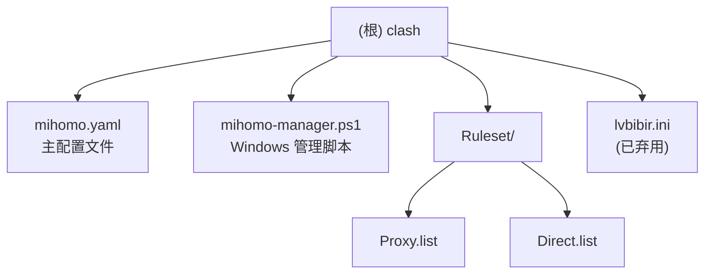

# Clash/Mihomo 代理配置项目

> 个人使用的 mihomo 内核配置文件, 适用于 Windows/Linux/macOS 等平台.

## 项目愿景

提供一套开箱即用、安全可靠的代理配置方案, 重点解决:
- DNS 防泄露 (Fake-IP + respect-rules + TUN 严格路由)
- 精细化分流 (8 层规则体系)
- 自动化节点选择 (URL-Test / Fallback)

## 架构总览

```
配置项目
    |
    +-- mihomo.yaml             主配置文件 (mihomo 内核)
    |       |
    |       +-- proxy-providers    订阅节点源
    |       +-- proxy-groups       策略组定义
    |       +-- rules              分流规则
    |       +-- rule-providers     规则集引用
    |
    +-- mihomo-manager.ps1      Windows 管理脚本 (交互菜单 + CLI)
    |
    +-- Ruleset/                自定义规则集模块
            |
            +-- Proxy.list  代理规则
            +-- Direct.list 直连规则
```

## 模块结构图



## 模块索引

| 模块 | 路径 | 职责 | 状态 |
|------|------|------|------|
| 根配置 | `/` | mihomo 主配置、订阅、策略组、规则体系 | 活跃 |
| [Ruleset](./Ruleset/CLAUDE.md) | `Ruleset/` | 自定义代理/直连规则列表 | 活跃 |

## 运行与开发

### 快速启动

**Linux/macOS:**
```bash
# 下载 mihomo 内核
wget https://github.com/MetaCubeX/mihomo/releases/latest/download/mihomo-linux-amd64 -O mihomo
chmod +x mihomo

# 启动 (需先修改订阅地址)
./mihomo -d . -f mihomo.yaml
```

**Windows (PowerShell):**
```powershell
# 使用管理脚本 (推荐)
.\mihomo-manager.ps1           # 交互菜单模式
.\mihomo-manager.ps1 start     # 命令行启动
.\mihomo-manager.ps1 status    # 查看状态
.\mihomo-manager.ps1 reload    # 重载配置
.\mihomo-manager.ps1 test https://www.google.com  # 测试 URL 延迟

# 延迟测试说明
# - 自动切换到不同策略组 (直连、美国、日本、狮城、台湾、香港)
# - 每次测试前清除 DNS 和 Fake-IP 缓存
# - 发起真实 HTTP 请求测量实际延迟
# - 测试完成后自动恢复原始策略组选择
# - 可在 mihomo 日志中看到真实连接信息

# 环境变量 (可选)
$env:MIHOMO_SECRET = "your_secret"  # 设置 API 密钥
```

### 配置修改

1. 编辑 `mihomo.yaml` 第 43 行, 替换订阅地址
2. 编辑 `Ruleset/*.list` 添加自定义规则

### 端口与服务

| 服务 | 地址 | 说明 |
|------|------|------|
| 混合代理 | `127.0.0.1:7890` | HTTP/SOCKS5 |
| DNS | `0.0.0.0:1053` | 本地 DNS |
| Web UI | `http://127.0.0.1:9090/ui` | 密码: `123456` |

## 测试策略

本项目为配置文件项目, 无自动化测试. 验证方式:

1. **DNS 泄露测试**: 访问 https://dnsleaktest.com/
2. **节点连通性**: Web UI 查看延迟测试结果
3. **规则匹配**: 使用 mihomo 日志 (`log-level: debug`)

## 编码规范

### YAML 配置

- 使用 2 空格缩进
- 使用 YAML 锚点 (`&name`) 和引用 (`*name`, `<<: *name`) 减少重复
- 注释使用 `#`, 与代码同行时前置 2 空格

### 规则列表 (.list)

- 每行一条规则
- 格式: `TYPE,VALUE[,OPTIONS]`
- 支持的 TYPE: `DOMAIN`, `DOMAIN-SUFFIX`, `DOMAIN-KEYWORD`, `IP-CIDR`

## AI 使用指引

### 常见任务

1. **添加代理规则**: 编辑 `Ruleset/Proxy.list`
2. **添加直连规则**: 编辑 `Ruleset/Direct.list`
3. **修改策略组行为**: 编辑 `mihomo.yaml` 的 `proxy-groups` 部分
4. **添加新订阅**: 在 `proxy-providers` 下添加新条目
5. **Windows 启动/管理**: 使用 `mihomo-manager.ps1` 脚本
6. **测试 URL 延迟**: 使用 `test` 命令对比不同节点的真实访问速度

### 关键配置位置

| 功能 | 文件 | 行号 |
|------|------|------|
| 订阅地址 | `mihomo.yaml` | 41-44 |
| 策略组定义 | `mihomo.yaml` | 161-195 |
| 规则列表 | `mihomo.yaml` | 197-274 |
| 规则集引用 | `mihomo.yaml` | 283-379 |
| DNS 配置 | `mihomo.yaml` | 68-86 |
| 管理脚本配置区 | `mihomo-manager.ps1` | 36-46 |

### 注意事项

- `lvbibir.ini` 已弃用, 仅供参考
- 订阅地址 (`url: '---'`) 需手动替换
- 规则顺序影响匹配优先级 (第一层优先级最高)

## 变更记录 (Changelog)

| 时间 | 操作 | 说明 |
|------|------|------|
| 2026-01-19 12:11:59 | 创建 | 初始化 AI 上下文文档系统 |
