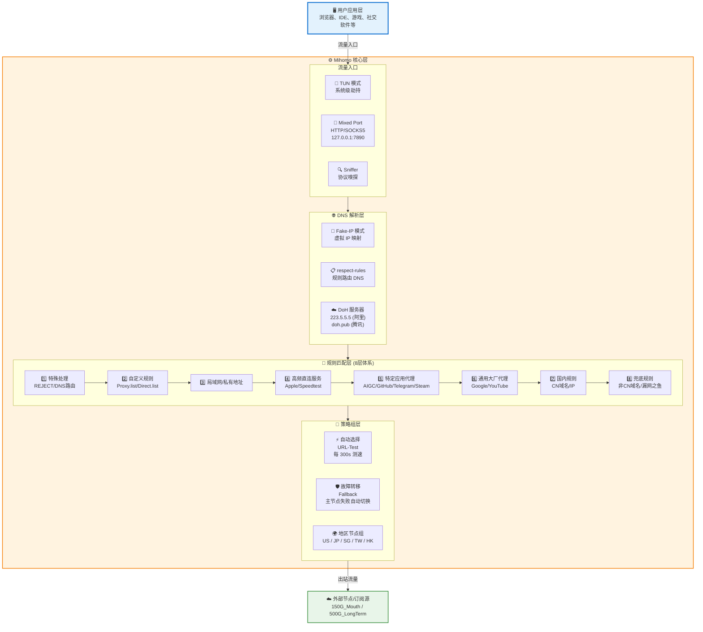
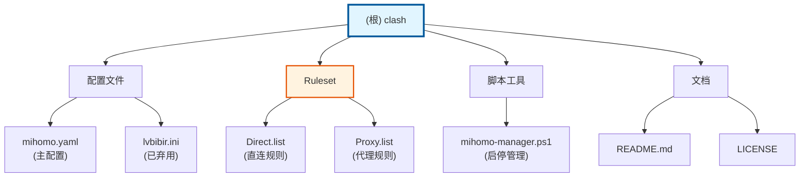

# Mihomo 配置项目 - AI 上下文文档

> 最后更新：2026-01-07 22:06:55

## 变更记录 (Changelog)

### 2026-01-07
- 初始化 AI 上下文文档系统
- 完成项目结构分析和文档生成

---

## 项目愿景

本项目是个人使用的 **Mihomo (Clash Meta) 内核配置仓库**，旨在提供一套跨平台（Windows/Linux/macOS）、功能完善、安全可靠的代理配置方案。核心特性包括：

- DNS 防泄露（Fake-IP + respect-rules + TUN 严格路由）
- 精细化分流规则体系（8 层规则）
- 性能优化（TCP 并发、连接复用、ARC 缓存）
- 地区节点分组与自动故障转移
- 配置管理自动化（PowerShell 脚本）

项目适用于需要稳定、高性能、可定制化代理服务的个人用户。

---

## 架构总览

### 技术栈

- **配置格式**: YAML (mihomo.yaml)、INI (lvbibir.ini - 已弃用)
- **规则格式**: Text (自定义规则)、MRS (Meta Rule Set)
- **管理工具**: PowerShell 脚本 (Windows)
- **核心引擎**: Mihomo (Meta Kernel)

### 核心架构设计



---

## 模块结构图



---

## 模块索引

| 模块名称 | 路径 | 职责 | 关键文件 | 语言 |
|---------|------|------|---------|------|
| **根目录** | `/home/lvbibir/clash` | 项目主配置与管理 | `mihomo.yaml`、`mihomo-manager.ps1` | YAML, PowerShell |
| **Ruleset** | `/home/lvbibir/clash/Ruleset` | 自定义分流规则 | `Direct.list`、`Proxy.list` | Text |

---

## 运行与开发

### 快速启动

#### Linux/macOS

```bash
# 1. 克隆仓库
git clone https://github.com/lvbibir/clash.git
cd clash

# 2. 下载 mihomo 内核
wget https://github.com/MetaCubeX/mihomo/releases/latest/download/mihomo-linux-amd64 -O mihomo
chmod +x mihomo

# 3. 修改订阅地址
# 编辑 mihomo.yaml 第 43 行，替换为你的订阅 URL

# 4. 启动服务
./mihomo -d . -f mihomo.yaml
```

#### Windows

使用 PowerShell 脚本：

```powershell
# 交互菜单模式
.\mihomo-manager.ps1

# 命令行模式
.\mihomo-manager.ps1 start    # 启动
.\mihomo-manager.ps1 status   # 查看状态
.\mihomo-manager.ps1 reload   # 重载配置
.\mihomo-manager.ps1 stop     # 停止
```

详细部署步骤：[mihomo 裸核部署 - Windows 端](https://www.lvbibir.cn/posts/tech/mihomo-core-only-setup)

### 关键端口

- **HTTP/SOCKS5 代理**: `127.0.0.1:7890` (mixed-port)
- **Web Dashboard**: `http://127.0.0.1:9090/ui` (密码: `123456`)
- **DNS 监听**: `0.0.0.0:1053`

### 配置修改

1. **修改订阅源**: 编辑 `mihomo.yaml:41-44`
2. **添加自定义代理规则**: 编辑 `Ruleset/Proxy.list`
3. **添加自定义直连规则**: 编辑 `Ruleset/Direct.list`
4. **启用 GeoDat 模式**: 取消 `mihomo.yaml:29-34` 注释

---

## 测试策略

### 手动测试

1. **DNS 泄露测试**:
   - [https://dnsleaktest.com/](https://dnsleaktest.com/)
   - [https://ipleak.net/](https://ipleak.net/)
   - 预期结果：显示代理服务器所在地 DNS，而非本地 ISP

2. **代理连通性测试**:
   ```bash
   # 测试 HTTP 代理
   curl -x http://127.0.0.1:7890 https://www.google.com

   # 测试 SOCKS5 代理
   curl --socks5 127.0.0.1:7890 https://www.google.com
   ```

3. **配置文件验证**:
   ```bash
   # Linux/macOS
   ./mihomo -t -d . -f mihomo.yaml

   # Windows PowerShell
   .\mihomo-manager.ps1 6  # 菜单选项 6
   ```

4. **规则匹配测试**:
   - 访问 Web Dashboard: `http://127.0.0.1:9090/ui`
   - 查看 Logs 标签页，观察实时规则匹配

### 性能测试

- **节点测速**: 在 Dashboard 中选择 Proxies → URL-Test，观察延迟
- **自动切换验证**:
  - 故障转移：断开当前节点，观察是否自动切换
  - URL-Test：等待 300 秒后检查是否选择最低延迟节点

---

## 编码规范

### 配置文件规范

1. **YAML 格式** (mihomo.yaml):
   - 使用 2 空格缩进（不使用 Tab）
   - 锚点命名使用 `PascalCase` (如 `&NodeParam`)
   - 策略组名称使用表情符号前缀（提高可读性）
   - 注释使用中文，放在配置项上方或行尾

2. **规则列表格式** (Ruleset/*.list):
   - 每行一条规则，使用 Clash 规则语法
   - 分类注释使用 `# === 类别 ===` 格式
   - 敏感域名规则使用 `DOMAIN-SUFFIX` 而非 `DOMAIN-KEYWORD`

3. **PowerShell 脚本规范**:
   - 使用完整的 cmdlet 名称（避免别名）
   - 函数命名遵循 `Verb-Noun` 规范
   - 关键操作前进行配置验证
   - 错误处理使用 `try-catch-finally`

### Git 提交规范

遵循 Conventional Commits：

```
<type>(<scope>): <subject>

[可选 body]
```

类型 (type)：
- `feat`: 新功能
- `fix`: 修复
- `docs`: 文档
- `refactor`: 重构
- `chore`: 杂项

作用域 (scope)：
- `mihomo`: mihomo.yaml 配置
- `ruleset`: 规则列表
- `script`: 脚本工具

---

## AI 使用指引

### 常见任务

1. **添加新的分流规则**:
   ```
   "请帮我在 Ruleset/Proxy.list 中添加 'example.com' 的代理规则，
   包括主域名和常见子域名"
   ```

2. **优化节点筛选正则**:
   ```
   "请检查 mihomo.yaml 中的 FilterUS 正则，确保能正确匹配
   'United States' 和 'US' 关键词，同时排除 'GB|流量|过期' 等"
   ```

3. **调试 DNS 泄露问题**:
   ```
   "请分析 mihomo.yaml 的 DNS 配置，确认 respect-rules 和
   proxy-server-nameserver 是否正确配置"
   ```

4. **生成新的策略组**:
   ```
   "请在 mihomo.yaml 中添加一个名为 '游戏加速' 的策略组，
   优先使用香港和日本节点"
   ```

### 上下文文件索引

执行配置修改前，建议先阅读：

- **核心配置**: `/home/lvbibir/clash/mihomo.yaml`
- **自定义规则**: `/home/lvbibir/clash/Ruleset/Proxy.list`
- **项目说明**: `/home/lvbibir/clash/README.md`
- **模块文档**: `/home/lvbibir/clash/Ruleset/CLAUDE.md`

### 安全边界

- **禁止操作**: 直接修改 `.git` 目录、生成二进制文件
- **谨慎操作**: 修改 `proxy-providers` URL（可能导致订阅失效）
- **需要确认**: 修改 DNS 配置、TUN 模式设置（可能影响网络连通性）

---

## 常见问题 (FAQ)

### 1. 为什么使用国内 DNS 也不会泄露？

因为 Fake-IP + respect-rules 机制：
- 应用获得的是虚拟 IP，不会直接触发 DNS 查询
- 真实 DNS 查询由 mihomo 根据规则路由
- 代理域名的 DNS 查询会通过代理隧道发送
- ISP 只能看到加密的代理流量

### 2. 如何验证 DNS 是否泄露？

访问以下网站测试：
- https://dnsleaktest.com/
- https://www.dnsleak.com/
- https://ipleak.net/

预期结果：应显示代理服务器所在地的 DNS，而非本地 ISP 的 DNS

### 3. 为什么某些网站无法访问？

可能是 Fake-IP 模式的兼容性问题：
1. 检查 `mihomo.yaml:79-80` 的 `fake-ip-filter`
2. 将问题域名添加到 `Ruleset/Direct.list`
3. 或在 fake-ip-filter 规则集中添加例外

### 4. 如何添加备用订阅？

取消 `mihomo.yaml:47-52` 的注释：
```yaml
500G_LongTerm:
  <<: *NodeParam
  url: '备用订阅地址'
  path: './proxy-providers/providers-2.yaml'
  override:
    additional-prefix: "1.备 "
```

### 5. 节点自动切换的逻辑是什么？

- **URL-Test 模式**: 每 300 秒测速，选择延迟最低的节点（容差 50ms）
- **Fallback 模式**: 主节点失败后自动切换到备用节点
- **健康检查**: 超时 2 秒判定失败，连续失败 3 次触发主动检查

### 6. PowerShell 脚本无法运行？

Windows 系统需要调整执行策略：
```powershell
# 临时允许（当前会话）
Set-ExecutionPolicy -Scope Process -ExecutionPolicy Bypass

# 永久允许（需要管理员权限）
Set-ExecutionPolicy -Scope CurrentUser -ExecutionPolicy RemoteSigned
```

---

## 参考资料

### 官方文档
- [mihomo wiki](https://wiki.metacubex.one/)
- [Clash Meta Kernel](https://github.com/MetaCubeX/mihomo)

### 规则集来源
- [MetaCubeX/meta-rules-dat](https://github.com/MetaCubeX/meta-rules-dat)
- [ShellCrash Fake-IP 过滤器](https://github.com/juewuy/ShellCrash/blob/dev/public/fake_ip_filter.list)

### 订阅转换
- [ACL4SSR 在线订阅转换](https://acl4ssr-sub.github.io/)
- [边缘订阅转换](https://bianyuan.xyz/)
- [Sub-Store](https://sub.dler.io/)

### 社区资源
- [sparkle TG 群组](https://t.me/xishang0128)
- [FlClash TG 群组](https://t.me/FlClash)

---

## 许可证

Apache License 2.0 - 详见 [LICENSE](LICENSE) 文件

---

## 免责声明

本项目仅供学习交流使用，请勿用于非法用途。使用本配置文件造成的任何后果由使用者自行承担。
